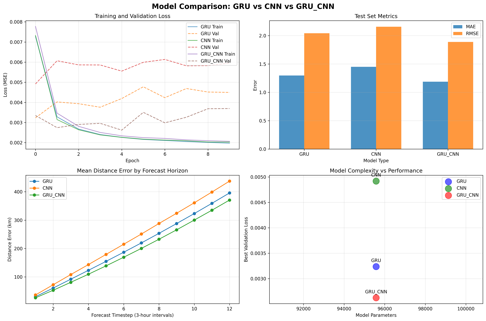

# TC Forecast Model Comparison Report
Generated: 2026-01-24 20:21:21

## Summary

| Model | Parameters | Best Val Loss | Test MAE | Test RMSE | Training Epochs |
|-------|-----------|---------------|----------|-----------|----------------|
| GRU | 95,576 | 0.0032 | 1.2971 | 2.0420 | 10 |
| CNN | 95,576 | 0.0049 | 1.4497 | 2.1569 | 10 |
| GRU_CNN | 95,576 | 0.0026 | 1.1876 | 1.8884 | 10 |

## Distance Errors (72-hour forecast)

| Model | 24h (km) | 48h (km) | 72h (km) |
|-------|----------|----------|----------|
| GRU | 253.49 | 395.95 | 395.95 |
| CNN | 288.19 | 437.63 | 437.63 |
| GRU_CNN | 232.67 | 370.87 | 370.87 |

## Recommendations

**Best Overall Model**: GRU_CNN
- Lowest validation loss: 0.0026
- Test MAE: 1.1876300573349

**Model Characteristics**:

- **GRU**: Good for temporal patterns, lowest parameters
- **CNN**: Good for local patterns, fast inference
- **GRU_CNN**: Hybrid approach, captures both spatial and temporal

## Visualization

